# Spoiled Milk

Spoiled Milk is my very changed take on RuneScape Classic.

I think this is my midlife crisis. Out of nowhere, I decided I wanted to meddle
with RuneScape Classic, and so here we are. I started with a desire to change a
few things that had always bothered me, like melee being split into three skills
while Ranged and Magic were each handled by one. Then it kept snowballing. I
kept wanting to change more until I had altered nearly every part of the game in
some way.

The version I built from was called Cabbage, and faithful preservation is often
called just that: preservation. So I stayed food-themed, picked the opposite of
preserved, and ended up with Spoiled Milk. It also felt fitting because changing
this much will probably be distasteful to some purists.

I also want to be direct about development: I used Codex to help code this. I
know AI-assisted projects are contentious, so I would rather say that plainly.
The new art assets were made by real people: some were commissioned or
purchased, some were sourced from free repositories, and a few were made by me.

## Contributing And Project Workflow

Spoiled Milk is owner-directed. If you want to submit code, ideas, artwork, or
AI-assisted work, start with [CONTRIBUTING.md](CONTRIBUTING.md) and the
[contributor guides](docs/contributor-guides/README.md).

## Fewer Words, More Pictures

A lot has changed or been added, and not all of it can be shown well in
screenshots. But pictures are easier to approach than a giant wall of text, so
start here.

### Combat

<table width="100%">
  <tr>
    <th width="50%">Summoning</th>
    <th width="50%">Magic enemies</th>
  </tr>
  <tr>
    <td width="50%" valign="top">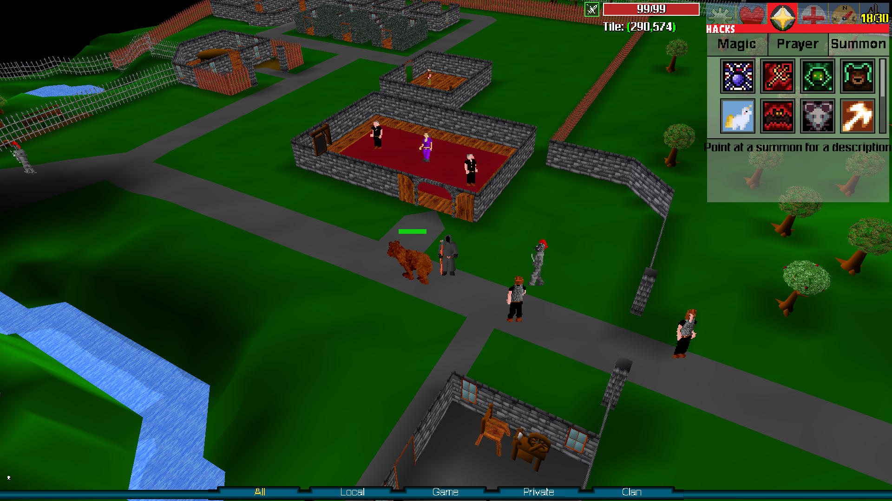</td>
    <td width="50%" valign="top">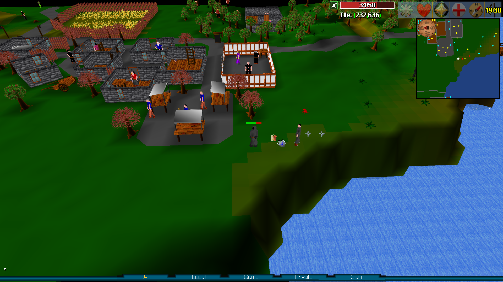</td>
  </tr>
  <tr>
    <td width="50%" valign="top">The new Summoning tab also shows the skill-icon interface. The Ironhide Bear summon is standing beside the player.</td>
    <td width="50%" valign="top">Enemies can attack with Magic. Magic power and Magic defense are both in the game and matter.</td>
  </tr>
</table>

<table width="100%">
  <tr>
    <th width="50%">Ranged enemies</th>
    <th width="50%">Multi-melee and AoE</th>
  </tr>
  <tr>
    <td width="50%" valign="top">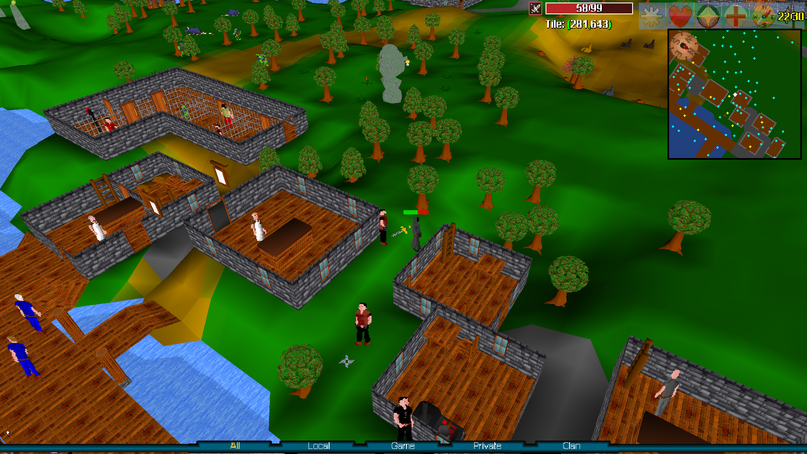</td>
    <td width="50%" valign="top">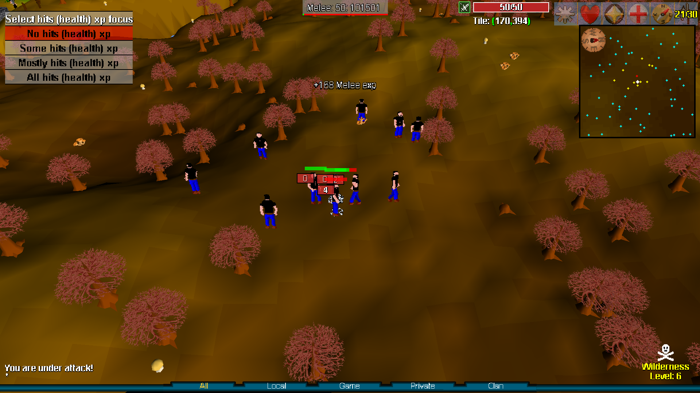</td>
  </tr>
  <tr>
    <td width="50%" valign="top">Thieves and other enemies can use ranged attacks. Ranged power and Ranged defense exist too.</td>
    <td width="50%" valign="top">Multiple enemies can attack in melee at once, and AoE melee weapons can answer back.</td>
  </tr>
</table>

<table width="100%">
  <tr>
    <th width="50%">AoE spells</th>
    <th width="50%">AoE ranged</th>
  </tr>
  <tr>
    <td width="50%" valign="top">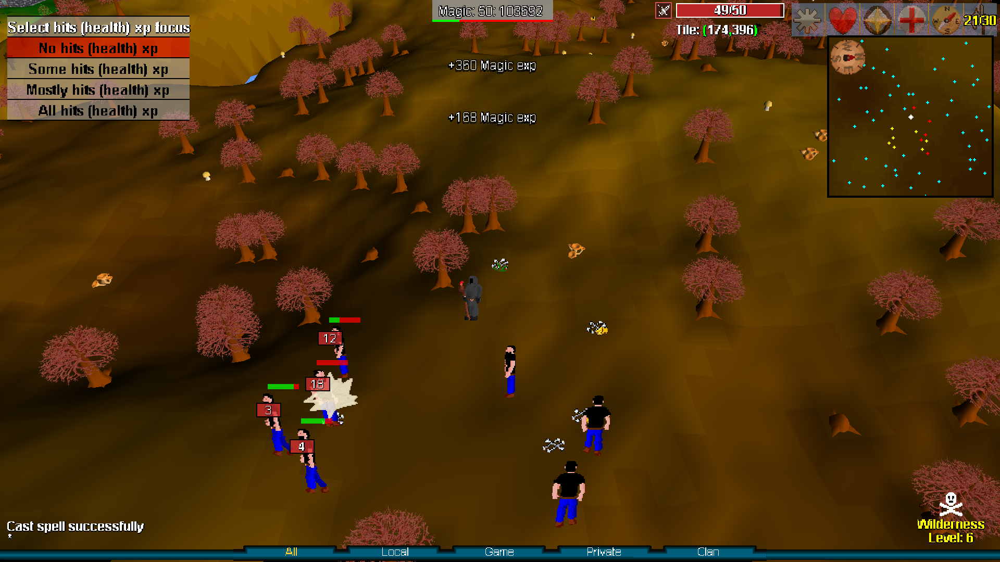</td>
    <td width="50%" valign="top">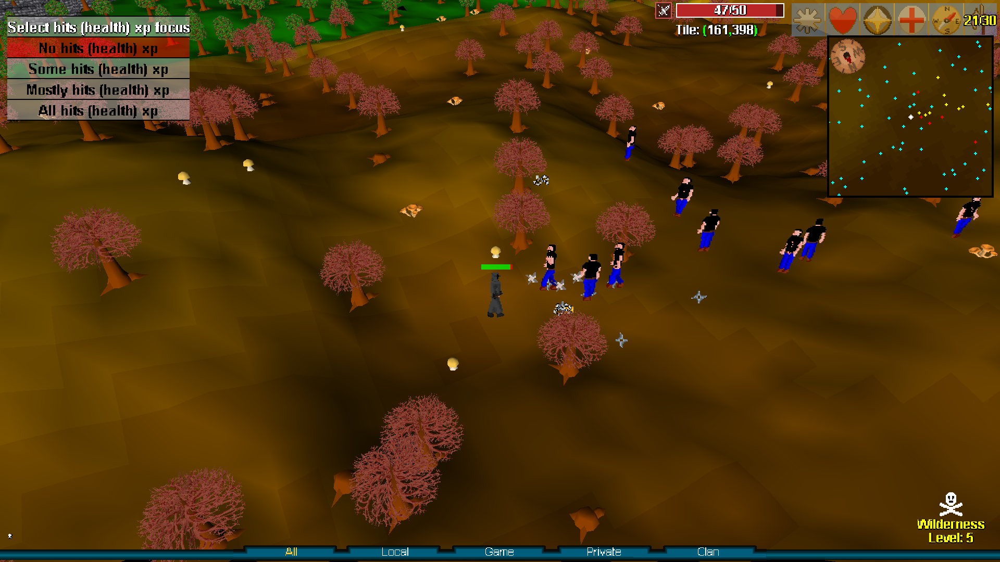</td>
  </tr>
  <tr>
    <td width="50%" valign="top">Spells have new animations, including AoE magic effects.</td>
    <td width="50%" valign="top">Ranged users have AoE options too, including shurikens.</td>
  </tr>
</table>

### Gear And Areas

<table width="100%">
  <tr>
    <th width="50%">Defensive armor identities</th>
    <th width="50%">Crafting Guild expansion</th>
  </tr>
  <tr>
    <td width="50%" valign="top">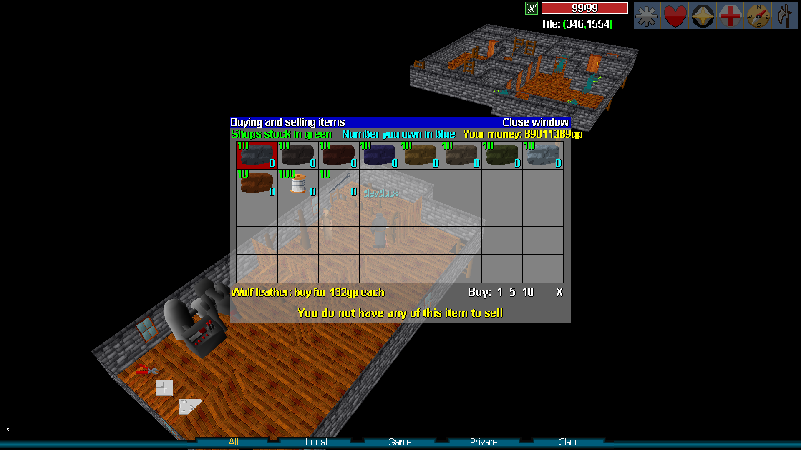</td>
    <td width="50%" valign="top">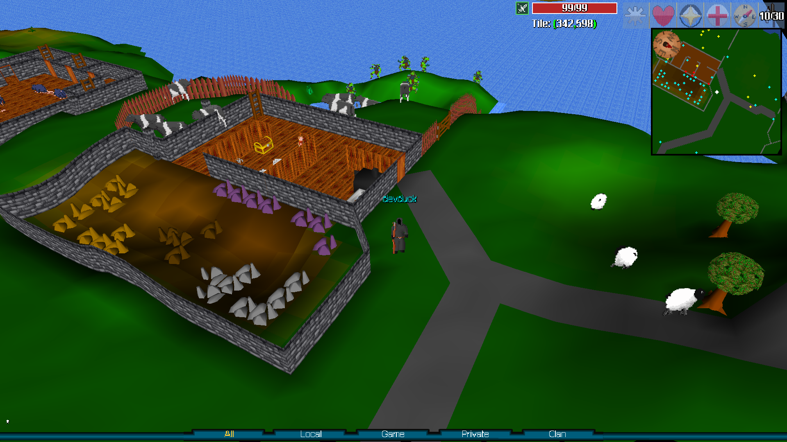</td>
  </tr>
  <tr>
    <td width="50%" valign="top">Armor is now purely defensive instead of being tied to combat styles. Leather armor inherits defenses from the monster it is made from and has unique set bonuses.</td>
    <td width="50%" valign="top">Guilds are being expanded with more resources and more reasons to visit them.</td>
  </tr>
</table>

<table width="100%">
  <tr>
    <th width="50%">Karamja Volcano expansion</th>
    <th width="50%">Heroes' Guild expansion</th>
  </tr>
  <tr>
    <td width="50%" valign="top">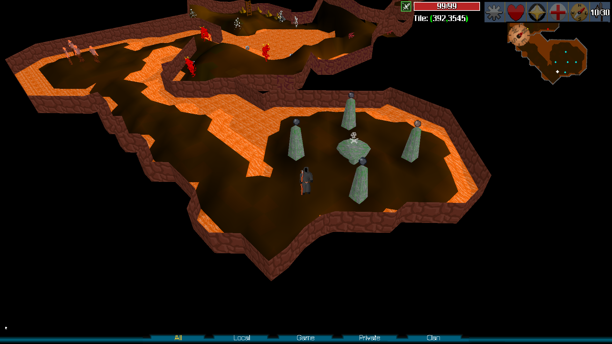</td>
    <td width="50%" valign="top">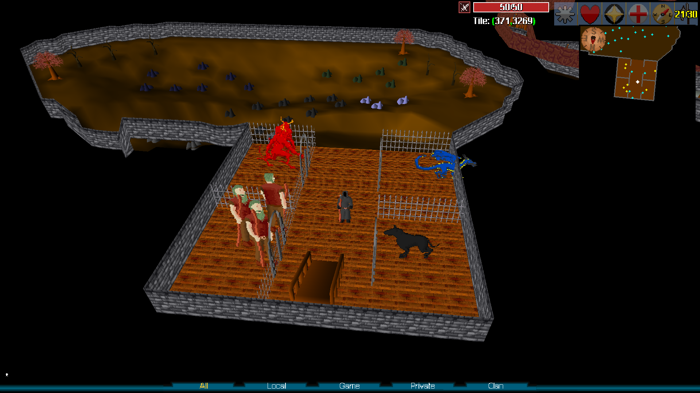</td>
  </tr>
  <tr>
    <td width="50%" valign="top">This Karamja Volcano expansion shows an overworld rune altar. Rune altars are not just for crafting runes anymore; they are part of the larger Enchanting system.</td>
    <td width="50%" valign="top">The goal is for every guild to feel bigger and better than it did before.</td>
  </tr>
</table>

### Handy UI Stuff

<table width="100%">
  <tr>
    <th width="50%">Bank filters</th>
    <th width="50%">Crafting interfaces</th>
  </tr>
  <tr>
    <td width="50%" valign="top">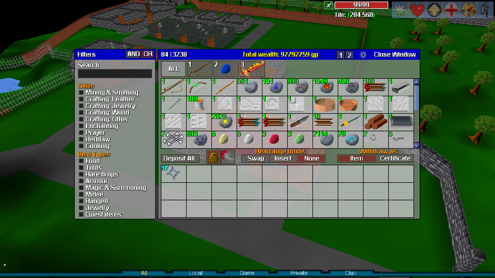</td>
    <td width="50%" valign="top">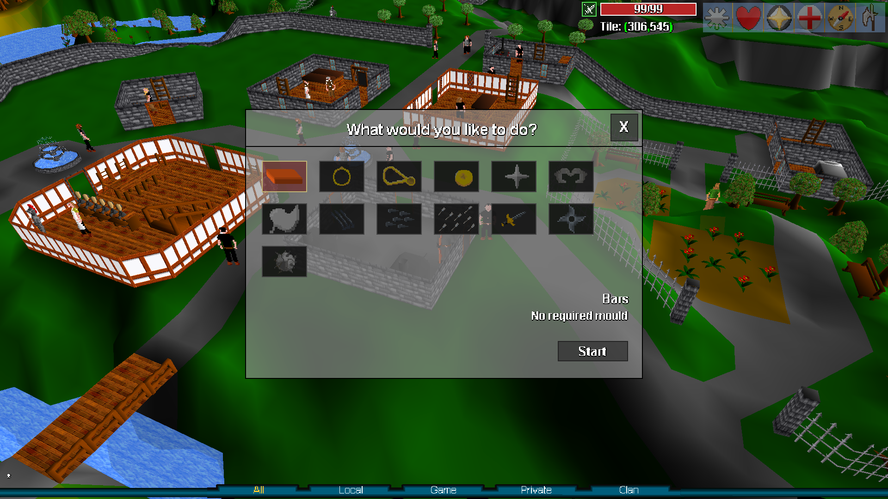</td>
  </tr>
  <tr>
    <td width="50%" valign="top">The bank has new filters, and the old binary item limit is gone. No more strange bank wraparound bug.</td>
    <td width="50%" valign="top">Crafting interfaces replace the old dialogue-menu crafting flow.</td>
  </tr>
</table>

<table width="100%">
  <tr>
    <th width="100%">Quest shortcuts</th>
  </tr>
  <tr>
    <td width="100%" valign="top">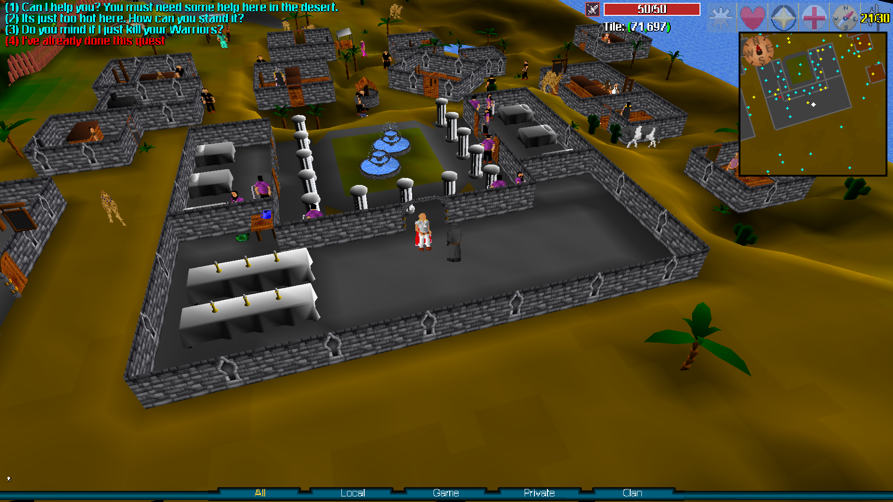</td>
  </tr>
  <tr>
    <td width="100%" valign="top">Already done the quests before? Don't want to do them again? Well now you can skip them and still get the rewards by telling the quest giver you've already done the quest.</td>
  </tr>
</table>

### OpenGL Renderer

<table width="100%">
  <tr>
    <th width="100%">Widescreen OpenGL view</th>
  </tr>
  <tr>
    <td width="100%" valign="top">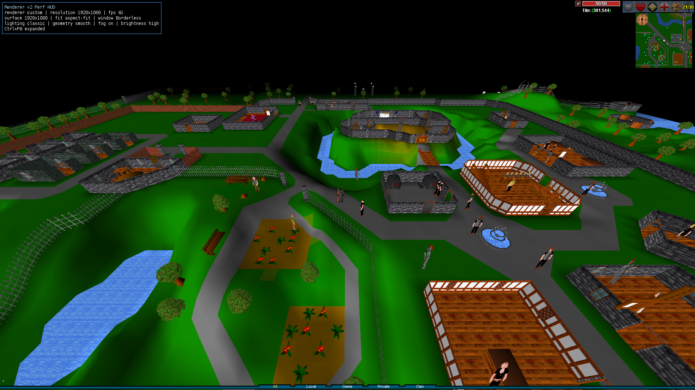</td>
  </tr>
  <tr>
    <td width="100%" valign="top">The new OpenGL renderer supports readable 4:3 and 16:9 aspect modes, with extra zoom providing the larger field of view and draw distance.</td>
  </tr>
</table>

<table width="100%">
  <tr>
    <th width="50%">Camera tilt</th>
    <th width="50%">Extra zoom</th>
  </tr>
  <tr>
    <td width="50%" valign="top">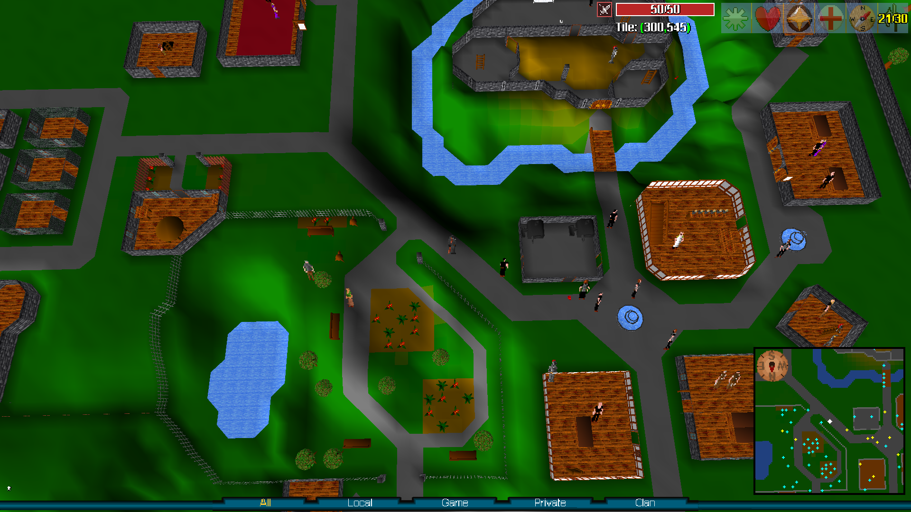</td>
    <td width="50%" valign="top">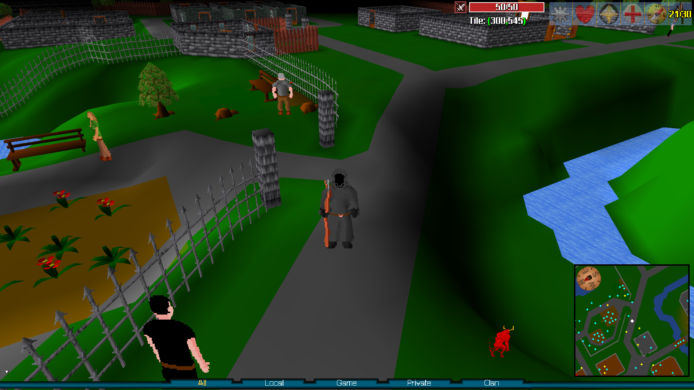</td>
  </tr>
  <tr>
    <td width="50%" valign="top">Added camera tilting so you can get a nice birds eye view</td>
    <td width="50%" valign="top">And also extra zoom in for a selfie</td>
  </tr>
</table>

## What Else Changed?

There is a lot of content that does not fit neatly into screenshots, so here is
the short version.

- Enchanting is a large new system built around rune altars and jewelry. It adds
  more than 1,000 item variations by letting every piece of jewelry be enchanted
  at every rune altar, among other things.
- Prayer is split into three devotions. Devotion is its own mechanic, can be
  built per god, and each god has its own set of prayers.
- Herblaw has new potions for the updated mechanics.
- Gathering skills have new rare drop tables.
- Gathering mechanics have been given a make-over and may at first glance seem
  slower but will quickly ramp up and become much more efficient.
- XP gain should keep a better pace as the game progresses, with more in-game
  ways to boost it.
- Agility gives reward pouches when you complete obstacle courses. The rewards
  are still experimental, but Agility needed something more satisfying.
- Combat has Magic and Ranged enemy styles, AoE options, summons, always-hit
  attacks, defensive armor identities, and more build choices.

Check the in-game guides for more details. I am trying to keep them up to date
as I add things, but I am also intentionally not listing everything here.
RuneScape Classic was a game of discovery before every answer lived in a wiki,
and I want Spoiled Milk to leave room for that.

Huge thanks to Fezzik, Fezmilk in game, for doing so much playtesting.

## Technical Stuff For Technical Nerds

The client has been moved to OpenGL. It supports actual resolution options
now instead of only scaling the old fixed-size view, and that made it possible
to increase the visual draw distance so the world loads farther away.

After learning about the bank item-limit bug, I also started looking for other
old limitations and odd legacy caps that could be cleaned up. Part of the goal
of Spoiled Milk is not only adding content, but modernizing the engine enough
that those old constraints stop shaping the game.

## Downloads And Development

Player packages are published through GitHub releases when available. Release
packaging notes and player launch instructions live in
[`docs/releases/`](docs/releases/).

For local development:

```bash
./scripts/build-client.sh
./scripts/build-server.sh
./scripts/run-server.sh
./scripts/run-dev-client.sh
```

`run-server.sh` starts a private local server on port `43615`. The public
hosted alpha uses `run-hosted-server.sh` from the dedicated live worktree.
Check what is running with `./scripts/live-status.sh`.

Current development notes are indexed in
[`docs/myworld/README.md`](docs/myworld/README.md).

Project workspace and hosting references:

- [`docs/workspaces/`](docs/workspaces/): safe multi-worktree setup for
  AI/contributor sessions.
- [`docs/hosting/`](docs/hosting/): current private-server hosting notes.
- [`legacy/`](legacy/): archived inherited material that is not part of the
  current build, release, or hosted-server workflow.

## Credits

New visual assets use the following source breakdown:

- **Pimen**: added runtime animations, distributed with artist permission for
  source-available distribution.
- **Pixel Banner**: Acid Gush, Earth Burst, Earth Impale, Ice Burst, Icicle
  Shot, Rock Throw, Thunder Ball, and Battering Ram icons.
- **KURAI**: Abyssal Demon, Astral Wraith, Duskwind Bat, Ironhide Bear,
  Mischief Imp, Broodling Spider, Delivery Camel, Restless Shade, and Zamorak's
  Void icons.
- **InDark**: Bound Battleaxe icon.
- **Atelier Pixerelia**: many Magic, Enchanting, and spell-effect icons.
- **COLEVID-19**: modified Mourning Unicorn and Sacred Unicorn icons.
- **Game-icons.net**: Prayer icons.
- **Shutterstock royalty-free listing**: Pack Rat icon.
- **Original work by the project author**: sprite additions including the
  fishing rod equipment sprites.

Source links:

- Pimen: https://pimen.itch.io/
- Atelier Pixerelia: https://pixerelia.itch.io/
- InDark: https://iridark.itch.io/
- Pixel Banner: https://pixel-banner.itch.io/
- KURAI: https://kurai7.itch.io/
- COLEVID-19: https://rcxno.itch.io/
- Game-icons.net: https://game-icons.net/
